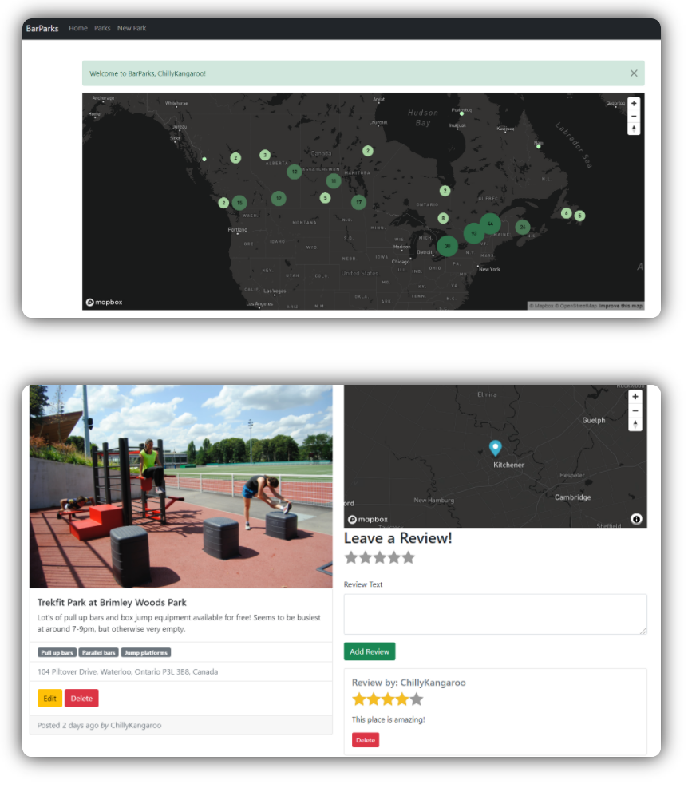

# BarParks
Full-stack web app built with Node, Express, and MongoDB. 

<p align="center">

</p>


# Todo:
- Redo front-end with React
- Fix deployment issue with Heroku

# Running it locally
1. Clone the repository

   ```
   git clone https://github.com/addison-ch/BarParks/
   cd BarParks
   npm install 
   ```

2. Install [MongoDB](https://www.mongodb.com/)

3. Create a Cloudinary account to get your **cloud name**, **API Key** and **API Secret**

4. Create a Mapbox account to get an **API access token**

5. Create an `.env` file in the root of this project and add following information:

   ```
   CLOUDINARY_CLOUD_NAME=<cloud name>
   CLOUDINARY_KEY=<API Key>
   CLOUDINARY_SECRET=<API Secret>
   MAPBOX_TOKEN=<API access token>
   ```

6. Run `mongod`, then run  `node app.js` in the terminal
7. Go to localhost:3000
